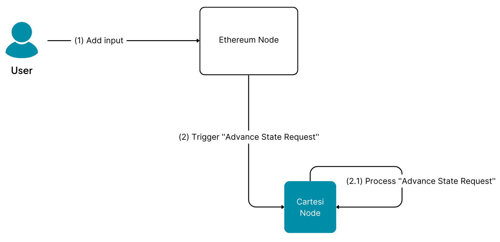

In Cartesi Rollups, the *input data* can be provided through:

* **Input** - Utilizing the [addInput()](./api/json-rpc/sol-input.md#addinput) function call via JSON-RPC to the [InputBox contract](./api/json-rpc/sol-input.md).
* **Inspect** - Making an external HTTP API call to the [Cartesi Node](./components.md#cartesi-nodes).

When you initiate your [node](./components.md#cartesi-nodes) for development purposes, you are effectively deploying Cartesi Rollups on a localhost testnet chain, which serves as your Ethereum network for development and mimics the mainnet's behavior (for example, Ganache, Anvil, Hardhat node). This means you will be sending transactions to contracts on this local chain.

## Input



JSON-RPC is a common interface for interacting with Ethereum nodes, allowing communication with the blockchain through remote procedure calls using JSON data structures.

In the context of Cartesi Rollups, we focus on two specific [JSON-RPC methods](https://ethereum.org/en/developers/docs/apis/json-rpc/):

* `eth_sendRawTransaction`. This method accepts signed transaction data as a parameter and returns a transaction hash. This method is particularly useful in production environments where security and privacy are essential, as the transactions are pre-signed with the sender's private key.

* `eth_sendTransaction`. This method is particularly suitable for development and testing environments, as it sends unsigned transactions that are signed by the Ethereum node using the specified account's private key.

These methods are used to call the `InputBox.addInput(address, bytes)` function of the DApp smart contract, using as parameters the alias address of your DApp Rollup and the content to submit.

New requests are handled within the Cartesi Machine using the [/finish](./api/rollup/finish.api.mdx) endpoint, by which you inform the final status of the previous request and retrieve input data. Here we create API-like handlers to manage and validate formats for this input data.

The following Python code example shows how a DApp reads the payload into a variable:

```py
rollup_server = environ["ROLLUP_HTTP_SERVER_URL"]
response = requests.post(rollup_server + "/finish", json={"status": "accept"})
rollup_request = response.json()
print("My new payload input", rollup_request["data"]["payload"])
```

The payload data is retrieved from the rollup server's response and stored in the payload variable for further processing.

## Inspect


The *Inspect* call is a direct request to the Rollup Node, which activates the Cartesi Machine (CM) without allowing it to modify its state. It serves as a way to examine the current state without making changes. To perform an Inspect call, you need to use an HTTP GET request to `<address of the node>/inspect/<payload in hex>`, for example:

```python
const url = http://localhost:5005/inspect"
const response = await fetch(path.join(url, payload));
assert(response.status == 200)

console.log(`Reports:`);
for (let i in result.reports) {
    let payload = result.reports[i].payload;
    console.log(`${i}: ${hex2str(payload)}`);
}
```

Below is a code example for a DApp where a request is made to the [/finish](./api/rollup/finish.api.mdx) endpoint with the status "accept" to process the rollup request. Once the response is received, the payload is extracted from the response data, allowing the user to examine the payload without altering the state of the Cartesi Machine.

```python
rollup_server = environ["ROLLUP_HTTP_SERVER_URL"]
response = requests.post(rollup_server + "/finish", json={"status": "accept"})
rollup_request = response.json()
print("My new payload inspect", rollup_request["data"]["payload"])
```

Now that we know how to handle generic payloads in our DApp, it is important to mention the concept of handling standardized Solidity interfaces, specifically ERC20 and ERC721 assets. To receive this special kind of *input data*, the Cartesi Rollup Framework provides a contract called the [Portal](./components.md#portal), which is specifically designed to [handle assets](./assets-handling.md) on behalf of your DApp.
